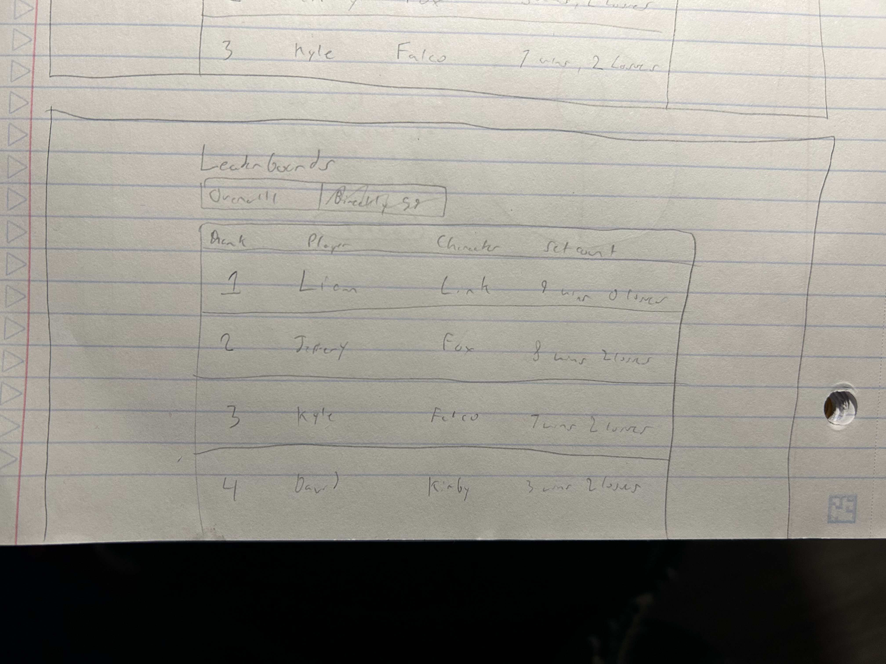

# Project 2: Design Journey

**For each milestone, complete only the sections that are labeled with that milestone.** Refine all sections before the final submission.

You are graded on your design process. If you later need to update your plan, **do not delete the original plan, rather leave it in place and append your new plan _below_ the original.** Then explain why you are changing your plan. Any time you update your plan, you're documenting your design process!

**Replace ALL _TODOs_ with your work.** (There should be no TODOs in the final submission.)

Be clear and concise in your writing. Bullets points are encouraged.

**Everything, including images, must be visible in _Markdown: Open Preview_.** If it's not visible in the Markdown preview, then we can't grade it. We also can't give you partial credit either. **Please make sure your design journey should is easy to read for the grader;** in Markdown preview the question _and_ answer should have a blank line between them.


## Design Plan (Milestone 1)

**Make the case for your decisions using concepts from class, as well as other design principles, theories, examples, and cases from outside of class (includes the design prerequisite for this course).**

You can use bullet points and lists, or full paragraphs, or a combo, whichever is appropriate. The writing should be solid draft quality.


### Catalog (Milestone 1)
> What will your catalog website be about? (1 sentence)

My catalog will be of Cornell Super Smash Brother's Melee tournament results.


### Audience (Milestone 1)
> Briefly explain your site's audience. Your audience should be specific, but not arbitrarily specific. (1 sentence)
> Justify why this audience is a **cohesive** group. (1-2 sentences)

The audience for this site is current tournament competitors of the Cornell Super Smash Brother's Melee club.

It may be a little specific, but the reason this is a cohesive group is because the only people that would really be looking at this information would be these current competitors. People that aren't in the club aren't going to be interested in tournament results for a niche game from 2001.


### Audience Goals (Milestone 1)
> Document your audience's goals for using this catalog website.
> List each goal below. There is no specific number of goals required for this, but you need enough to do the job (Hint: It's more than 1. But probably not more than 3.)
> **Hint:** Users will be able to view all entries in the catalog and insert new entries into the catalog. The audience's goals should probably relate to these activities.

Goal 1: See the most recent bi-weekly tournament results

- **Design Ideas and Choices** _How will you meet those goals in your design?_
  - I will make sure that the most recent tournament's tournament results are on the front page of the site, from first placing player to last. The tournament results will include dates to know that its the most recent one.
- **Rationale & Additional Notes** _Justify your decisions; additional notes._
  - The audience of my site is interested in seeing the most recent tournament results because as frequent competitors, their placements matter to how they will be ranked for the whole semester.

Goal 2: View who the current best people _overall_ are

- **Design Ideas and Choices** _How will you meet those goals in your design?_
  - I think having the ability to sort between either overall results or newest results could help this goal. Although it might be difficult, it would really help if I could use the database of latest results to actually generate the overall results, so the people coming to see the page would have the most up to date information possible.
- **Rationale & Additional Notes** _Justify your decisions; additional notes._
  - The audience of the site is current competitors of the cornell smash club in melee. The frequent competitors care about their current or overall placement in the club, so having an option to see that on the front page would be important to them, and also easily accessible.

Goal 3: (For admins) Be able to upload the new bi-weekly results

- **Design Ideas and Choices** _How will you meet those goals in your design?_
  - The competitors should not be able to upload their own results. For this site, only admins of the site should be able to add the results, however for the sake of this project, I am going to keep access to the form on the top of the front page so results can be added with ease.
- **Rationale & Additional Notes** _Justify your decisions; additional notes._
  - Since tournament results will go from newest on top to oldest on bottom, it makes sense to have the form to add a new one be on top, because that's where the newest results will pop up anyways.


### Audience Device (Milestone 1)
> How will your audience access this website? From a narrow (phone) or wide (laptop) device?
> Justify your decision. (1 sentence)

Laptop device.

The reason that the site's audience will be primarily viewing this on a laptop device is that they only really need to visit the site once every other week. When they do, they're gonna want to see all the details of the results when they get home from the tournament, and that situation will most likely be on a laptop at home.


### Persona (Milestone 1)
> Use the goals you identified above to develop a persona of your site's audience.
> Your persona must have a name and a face. The face can be a photo of a face or a drawing, etc.


[Source](https://www.ssbwiki.com/Smasher:Axe)

Jeffery Axe

**Factors that Influence Behavior:**


- Their desire of wanting to really be within the top 8 makes them check the website every time new tournament results are released.
- Since they need to go home early from every tournament, the newest results will be posted by the time they get home, so Jeffery will most likely be viewing the page on his laptop,

- Jeffery wants to get ranked within the top 8 for the current semester.

- Jeffery needs to go home early from every tournament

**Desires:**

- Jeffery wants to see the current top 8 players overall for the semester, mostly to see where he stands against the competition.


### Catalog Data (Milestone 1)
> Using your persona, identify the data you need to include in the catalog for your site's audience.
> Justify why this data aligns with your persona's goals. (1 sentence)

The data for each entry would go something like this

- Placement (1st 2nd 3rd etc)
- Player Name
- Character Played
- Set count (Wins to losses that tournament)
- Tournament Name
- Tournament Date

This should be the bare minimum amount of data Jeffery would need to see how other players stack up against himself for a given tournament. Jeffery needs to see the players name and their placement at the minimum to know how he's doing and how other people are doing, something which matters alot to him.

Placement and Player Name are arguably the most important to Jeffery. He wants to be ranked top 8 for the semester, and if he wants to do that, he needs to see who he's gotta beat in what order. Seeing the character they play also will help Jeffery by telling him what character he needs to practice against to get better results. The Tournament Name and Tournament Date are also important for seperating each bi-weekly tournament.


### Site Design (Milestone 1)
> Design your catalog website to address the goals of your persona.
> Sketch your site's design:
>
> - These are **design** sketches, not _planning_ sketches.
> - Use text in the sketches to help us understand your design.
> - Where the content of the text is unimportant, you may use squiggly lines for text.
> - **Do not label HTML elements or annotate CSS classes.** This is not a planning sketch.
>
> Provide a brief explanation _underneath_ each sketch. (1 sentence)
> **Refer to your persona by name in each explanation.**


In this first sketch, we have the add results form which asks for tournament name, data, and all the placement data needed to add results. Jeffery is not going to see this in a real release, and that's ok because adding the results is not his job, not to mention that he cannot be trusted to add results as he may fake them. The result entry goes from 1 to 8, which is the typical result pattern for all super smash brothers melee tournaments. The character form will have a drop down menu to select from the limited amount of characters in the game, as entering them in manually could lead to spelling errors that may actually matter.

Below we have the leaderboard section, the actual meat of the website, and it's what Jeffery actually cares about. As you can see, the tournament date and name aren't actually included in the result list, as that will be apart of the tab you select to see the specific leaderboard. In retrospect, date may not be needed, and possibly only the tournament name should be it. The leaderboard is in list format from rank one to eight, and that's exactly what Jeffery needs to size himself up against everyone else.



This second design is with the form hidden, which would be default. There are two tabs, the overall rankings and any other tournament rankings. The any other tab will have a dropdown where you can select the tournament results you want to view. The leaderboard on either tab will follow the same format including ranks from 1-8. This is all Jeffery needs to see how he is doing in the cornell melee tournament scene.


### Catalog Design Patterns (Milestone 1)
> Explain how you used design patterns for online catalogs in your site's design. (1-2 sentences)

The tournament results follow a list format, and since it's a ranking, it goes from top to bottom like most rankings do.


## Implementation Plan (Milestone 1, Milestone 2)

**Provide enough detail in your plan that another 2300 student could implement your plan.**

### Database Schema (Milestone 1)
> Plan the structure of your database. You may use words or a picture.
> A bulleted list is probably the simplest way to do this.
> Make sure you include constraints for each field.

Table: tournament_results

- id: INTEGER {NN, U, AI, PK},
- placement: INTEGER {NN},
- name: STRING {NN},
- character: STRING {NN},
- set_count: STRING {NN}
- tournament_name: STRING {NN},
- tournament_date: INTEGER {NN}


### Database Query Plan (Milestone 1, Final Submission)
> Plan your database queries.
> You may use natural language, pseudocode, or SQL.

1. All Records (Milestone 1)

    ```
    $data = open_sqlite_db('secure/site.sqlite');

    $result = exec_sql_query($data, 'SELECT * FROM tournament_results;');

    $tourneydata = $result->fetchAll();
    ```

2. Insert Record (Final Submission)

    ```
      for ($i = 1; $i <= 8; $i++) {
      $result = exec_sql_query(
        $data,
        "INSERT INTO tournament_results (name, placement, character, set_count, tournament_name, tournament_date) VALUES (:name, :placement, :character, :set_count, :tournament_name, :tournament_date);",
        array(
          ':name' => $form_inputs['name'.$i],
          ':character' => $form_inputs['character'.$i],
          ':set_count' => $form_inputs['set_count'.$i],
          ':tournament_name' => $form_inputs['tournament_name'],
          ':tournament_date' => $form_inputs['tournament_date']
        )
      );
    }
    ```


### From Validation (Milestone 2)
> Plan the validation criteria for each piece of form data.

- name
  - Must not be empty. Any name is valid.
- character
  - Must not be empty.
- set_count
  - Must not be empty.
- tournament_name
  - Must not be empty.
- tournament_date
  - Must not be empty. Must follow format of mmddyy.


### Form Planning (Milestone 2)
> Plan your form validation using **pseudocode**.

```
isValid = true;
if name is empty
  isValid is false
  show feedback
if character is empty
  isValid is false
  show feedback
if set_count is empty
  isValid is false
  show feedback
if tournament_name is empty
  isValid is false
  show feedback
if tournament_date is empty || type tournament_date is not integer || lenght of tournament_date is not 6 characters
  isValid is false
  show feedback
```


### Form Test Data (Milestone 2)
> For each piece of form data, provide samples of valid and invalid data for testing.

**Valid Test Data:**

- name: "Liam"
- name: "" (invalid)
- placement: 1
- placement: 3.14159 (invalid)
- placement: "" (invalid)
- character: "Link"
- character: "" (invalid)
- set_count: "3:2"
- set_count: "" (invalid)
- tournament_name: "Cornell Smash Biweekly 53"
- tournament_name: "" (invalid)
- tournmanet_date: 012323
- tournament_date: "012323" (invalid)
- tournament_date: 012 (invalid)

**Invalid Test Data:**

- sorry I put them all above listed with (invalid in parenthesis)
- just read that


## Complete & Polished Website (Final Submission)

### Accessibility Audit (Final Submission)
> Tell us what issues you discovered during your accessibility audit.
> What do you do to improve the accessibility of your site?

There are a lot of contrast issues with my site. Some text may be too hard to see for some users against certain colors in the background. There is also issues on the forms not having labels. The issue with this is that I could not put labels because all of the fields require similar information, which is why I just put one label for each column and row. The colors are also a stylistic choice and I am unsure at the moment what I should do to change them for better contrast. It's hard to let go of what I already have.

Edit: I fixed the contrast issues.


### Self-Reflection (Final Submission)
> Reflect on what you learned during this assignment. How have you improved from Project 1? What would you do differently next time? (2-3 sentences)

I learned from this assignment that overambition is really hard to overcome. I really wanted to make this project great but I also believe the end product isn't as polished as it should be. With project one I had a clear objective and completed it without trouble. This assignment had me writing so much code that I knew shouldn't have been necessary if I had just kept it simple. Next time, I'm using a smaller idea.


> Take some time here to reflect on how much you've learned since you started this class. It's often easy to ignore our own progress. Take a moment and think about your accomplishments in this class. Hopefully you'll recognize that you've accomplished a lot and that you should be very proud of those accomplishments! (1-3 sentences)

Although this was a super daunting project, I'm happy it didn't end up being completely broken and unuseable. In fact im pretty happy with how it looks. It's really cool to know how to use databases now, as the possibilites seem endless now! Pat on the back for me, but at the same time, there's a lot more to be done.


### Collaborators (Final Submission)
> List any persons you collaborated with on this project.

None


### Reference Resources (Final Submission)
> Please cite any external resources you referenced in the creation of your project.
> (i.e. W3Schools, StackOverflow, Mozilla, etc.)

W3Schools for php syntax.

### Final Notes

There are many things that are a bit "janky" with this assignment. I had to use alot of php code to format the form submissions in the way that I wanted, and it all felt redundant. The form is also massive, with 24 fields! That made it an absolute pain to write html and php. It was a nightmare, and that may be reflected in the code quality as well.

I decided to remove the ability to input placement, as in all tournaments, all data that is held consists of a top 8 and nothing more. It didn't make sense to hold more or less, and my persona would also be ok with that.
